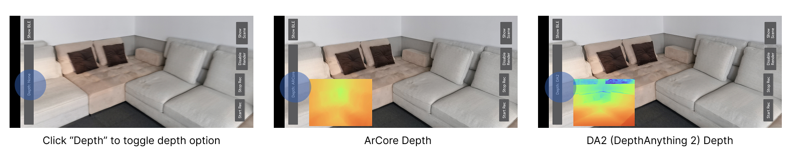
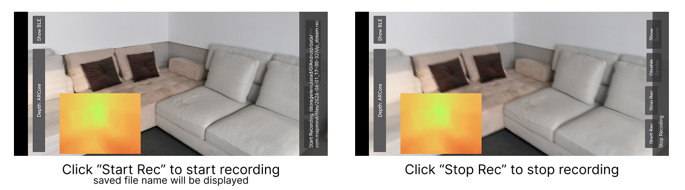

# VisualLocalizationAndroidClient

Make an Android phone act as an RGBD + pose sensor for local mapping and visualization.

中文说明文档: [README_zh.md](README_zh.md)

## Overview

**VisualLocalizationAndroidClient** is an Android application that turns a smartphone into a low-cost visual localization module for robotics.

The idea is simple: instead of using an expensive LiDAR or a dedicated RGBD camera plus an external computing board, we can reuse an Android phone that already has a camera, IMU, CPU/GPU, battery, display, Wi-Fi, and ARCore support.

With ARCore, the phone can provide visual-inertial odometry (VIO), camera pose estimation, and depth-related information on supported devices. This project uses the phone as a front-end sensor module and sends visual localization data to a robot or remote backend service.

The goal is to make an old phone work like a compact **RGBD + VIO sensor module** for autonomous robots.

## Motivation

I am building an autonomous robot and I need a localization and navigation module.

Common solutions have several limitations:

- Multi-line LiDAR works well, but it is too expensive for low-cost robots.
- Single-line LiDAR is cheaper, but it mainly provides 2D information.
- RGBD cameras such as RealSense or Orbbec can provide RGB, depth, and IMU data, but they usually do not directly provide a complete VIO/localization solution.
- To use those RGBD cameras for robot localization, an extra development board or mini PC is often required to run VIO, SLAM, mapping, or navigation algorithms.

Then I noticed an old Android phone I had used many years ago.

A smartphone already contains many of the components needed by a robot:

- RGB camera
- IMU
- On-device computing power
- Battery
- Display
- Wi-Fi
- ARCore support on many Android devices

This made me realize that an old phone could become a low-cost robotics perception module.

## Repository layout

- `app_vlp/`: Android app and native bridge to publish frame/depth/pose and optionally record datasets.
- `mapping/`: C++ mapping runtime and web viewer.
  - `mapping/mono_vio_ws_stream_client.cc`: main replay + mapping executable.
  - `mapping/common/data_session.*`: VLPREC1 reader.
  - `mapping/voxblox/voxblox_processor.*`: TSDF/ESDF integration and visualization extraction.
  - `mapping/backend/web_client.html`: web frontend.
- `python/`: tooling clients and `vlprec_reader.py` dataset inspector.
- `data/`: local datasets/screenshots (not guaranteed to exist on a fresh clone).


## How to use the APP

Download and install the apk file from https://github.com/MapMindAI/VisualLocalizationAndroidClient/releases/tag/v1

(1) Choose the depth source (None/ArCore/DA2):



https://github.com/user-attachments/assets/a09d27c3-eaa6-4b30-9971-52d8b2d8827e


(2) Start/Stop recoding:



## Dataset format

Recorded sessions use `VLPREC1` container with per-frame payloads containing:
- VLP2 frame header (timestamp, intrinsics, pose)
- JPEG image body
- optional depth chunk(s) tagged `DPT1`

Depth is decoded as metric `CV_32F` and integrated without resizing; intrinsics are scaled to depth resolution before integration.


## Build & Run mapping replay + web viewer

Current C++ mapping pipeline (`//mapping:mono_vio_ws_stream_client`) replays recorded sessions and:
- decodes JPEG + pose per frame
- reads recorder depth attached in payload
- integrates depth + pose into Voxblox TSDF/ESDF
- publishes trajectory + ESDF 3D points + ESDF 2D plane slice to a built-in web viewer

Build mapping viewer:

```bash
bazel build //mapping:mono_vio_ws_stream_client
```

Run:

```bash
./bazel-bin/mapping/mono_vio_ws_stream_client \
  --data_session=data/files/<session_dir>/vlp_stream.rec \
  --logtostderr=1 \
  --enable_websocket=true \
  --websocket_port=9002 \
  --enable_voxblox=true
```

Open:

```text
http://127.0.0.1:9002/index.html
```

https://github.com/user-attachments/assets/77e57cfb-af64-442e-8c0e-f65b7eb5f4ae


## Python utilities

Inspect and play recorded datasets:

```bash
python3 python/vlprec_reader.py --input data/files/<session_dir>/vlp_stream.rec --display
```

Other Python gRPC/web clients are in `python/README.md`.
