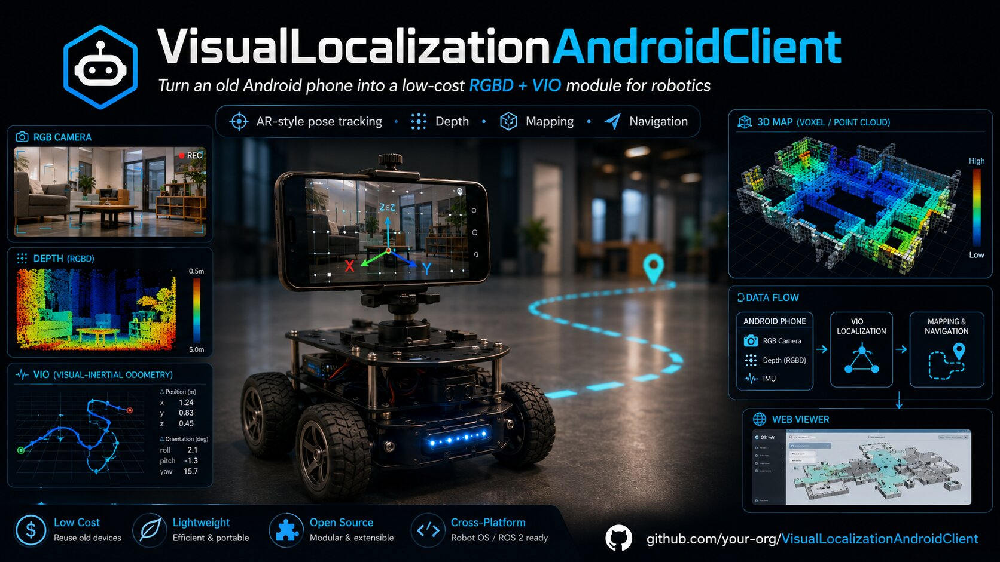
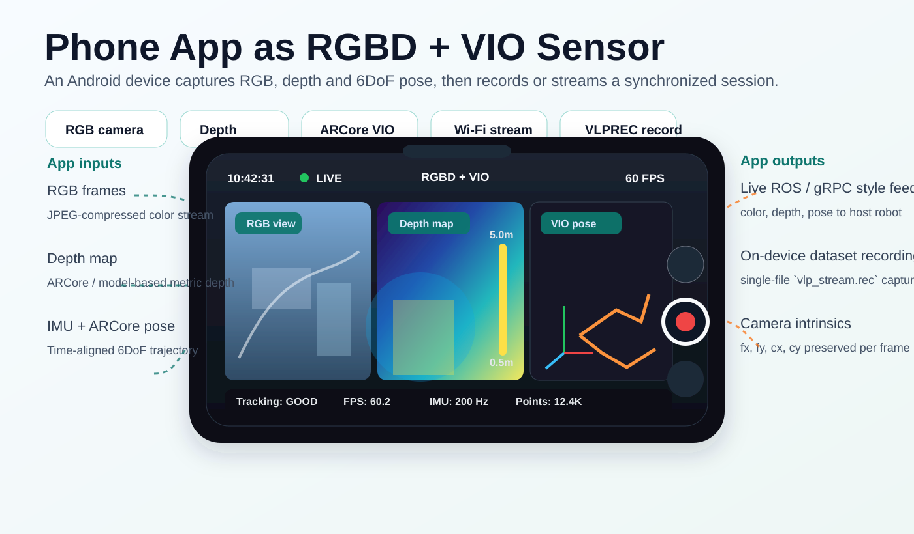
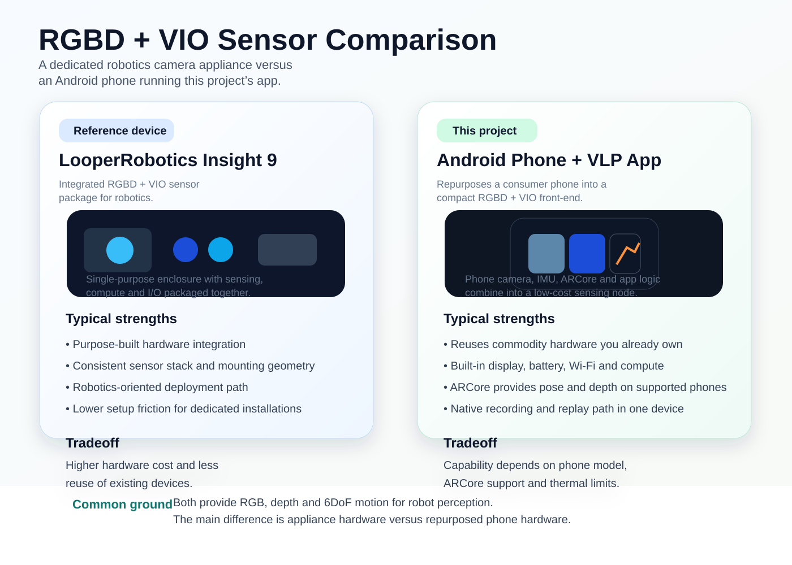
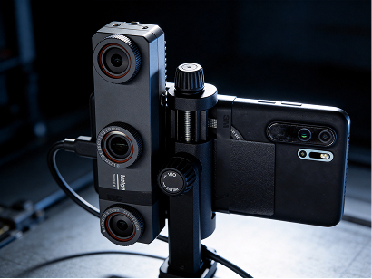
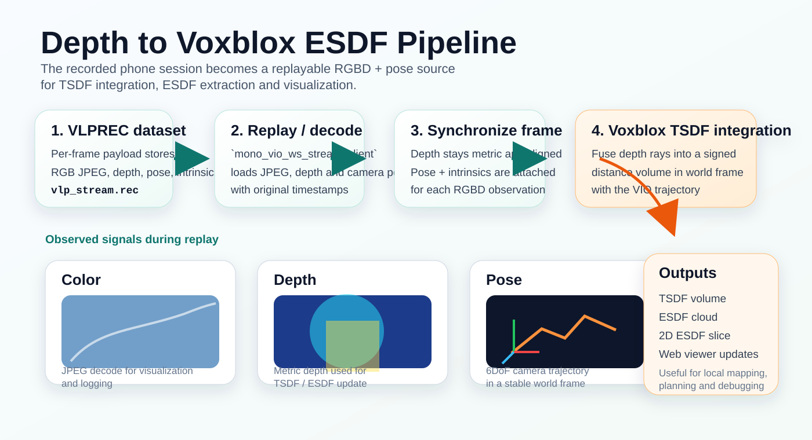
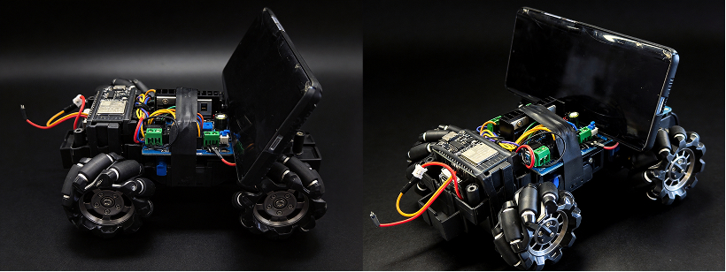

# VisualLocalizationAndroidClient

让一台 Android 手机充当本地建图与可视化所需的 RGBD + 位姿传感器。



## 项目概述

**VisualLocalizationAndroidClient** 是一个 Android 应用，可将智能手机变成机器人低成本视觉定位模块。

核心思路很直接：相比使用昂贵的激光雷达，或 RGBD 相机 + 额外计算板卡的组合，我们可以复用一台本身就具备相机、IMU、CPU/GPU、电池、屏幕、Wi-Fi 和 ARCore 能力的 Android 手机。

在支持的设备上，ARCore 可提供视觉惯性里程计（VIO）、相机位姿估计以及与深度相关的信息。本项目将手机作为前端传感器模块，把视觉定位数据发送给机器人或远端后端服务。

目标是让旧手机变成一个紧凑的 **RGBD + VIO 传感器模块**，用于自主机器人。



## 背景动机

我在做一台自主机器人，需要定位与导航模块。

常见方案存在一些限制：

- 多线激光雷达效果好，但对低成本机器人来说价格偏高。
- 单线激光雷达成本更低，但主要提供 2D 信息。
- RealSense、Orbbec 等 RGBD 相机可提供 RGB、深度和 IMU 数据，但通常不直接提供完整的 VIO/定位方案。
- 若要将这类 RGBD 相机用于机器人定位，通常还需要额外开发板或 mini PC 来运行 VIO、SLAM、建图或导航算法。

随后我注意到一台多年前使用过的旧 Android 手机。

智能手机已经具备机器人所需的许多组件：

- RGB 相机
- IMU
- 端侧算力
- 电池
- 屏幕
- Wi-Fi
- 许多 Android 设备支持 ARCore

这让我意识到：旧手机可以成为一个低成本的机器人感知模块。

## 传感器对比

本项目所解决的问题，与 [LooperRobotics Insight 9](https://looper-robotics.com/) 这类专用 RGBD + VIO 相机产品处于同一方向；不同之处在于，本项目使用手机作为感知与计算前端，而不是专用一体化硬件。





## 仓库结构

- `app_vlp/`：Android 应用与 native bridge，用于发布图像/深度/位姿，并可选录制数据集。
- `mapping/`：C++ 建图运行时与 Web 可视化。
  - `mapping/mono_vio_ws_stream_client.cc`：主回放 + 建图可执行程序。
  - `mapping/common/data_session.*`：VLPREC1 读取器。
  - `mapping/voxblox/voxblox_processor.*`：TSDF/ESDF 融合与可视化数据提取。
  - `mapping/backend/web_client.html`：Web 前端。
- `python/`：工具客户端与 `vlprec_reader.py` 数据集检查工具。
- `data/`：本地数据集/截图（全新克隆后不保证存在）。

## APP 使用方法

从以下地址下载并安装 APK：
https://github.com/MapMindAI/VisualLocalizationAndroidClient/releases/tag/v1

(1) 选择深度来源（None/ArCore/DA2）：


https://github.com/user-attachments/assets/a09d27c3-eaa6-4b30-9971-52d8b2d8827e


(2) 开始/停止录制：


## 数据集格式

录制会话采用 `VLPREC1` 容器，每帧 payload 包含：
- VLP2 帧头（时间戳、内参、位姿）
- JPEG 图像数据
- 可选深度块（标记为 `DPT1`）

深度会解码为米制 `CV_32F`，并在不改变分辨率的情况下融合；融合前会把内参按深度分辨率进行缩放。


## 构建与运行建图回放 + Web 可视化

当前 C++ 建图流程（`//mapping:mono_vio_ws_stream_client`）会回放录制会话，并执行：
- 每帧解码 JPEG + 位姿
- 读取 payload 中附带的录制深度
- 将深度 + 位姿融合进 Voxblox TSDF/ESDF
- 向内置 Web 可视化发布轨迹 + ESDF 三维点 + ESDF 二维平面切片

构建 mapping viewer：

```bash
bazel build //mapping:mono_vio_ws_stream_client
```

运行：

```bash
./bazel-bin/mapping/mono_vio_ws_stream_client \
  --data_session=data/files/<session_dir>/vlp_stream.rec \
  --logtostderr=1 \
  --enable_websocket=true \
  --websocket_port=9002 \
  --enable_voxblox=true
```

打开：

```text
http://127.0.0.1:9002/index.html
```

https://github.com/user-attachments/assets/77e57cfb-af64-442e-8c0e-f65b7eb5f4ae

## 建图流程

建图侧会回放录制得到的 RGBD + 位姿数据，将其送入 Voxblox，并输出 ESDF 结果用于可视化以及后续规划。



## Python 工具

检查并播放录制数据集：

```bash
python3 python/vlprec_reader.py --input data/files/<session_dir>/vlp_stream.rec --display
```

其他 Python gRPC/Web 客户端见 `python/README.md`。

## WIP：把它做成一台自主机器人



这个项目正在从“基于手机的 RGBD + VIO 传感器”逐步扩展为一个完整的自主机器人系统。

当前正在推进的工作包括：

- 通过 BLE 将手机 App 连接到 [IDF_esp32_robot](https://github.com/MapMindAI/ESP32-Robot-Control)。
- 基于录制或实时流式传输的 RGBD + 位姿数据构建本地 ESDF 地图。
- 让机器人能够自主探索周围环境。
- 利用 ESDF 地图进行导航，让机器人前往用户指定目标。
